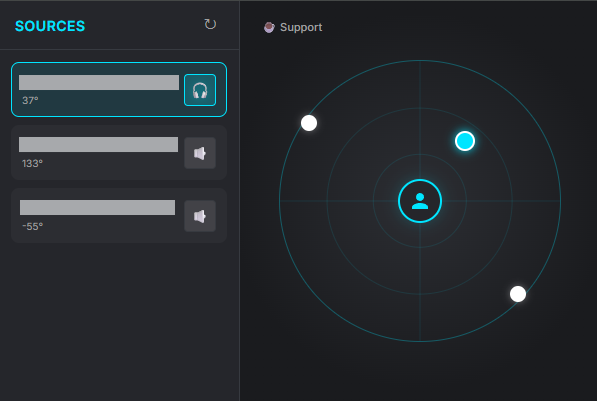

# YouTube Audio Spatial Splitter 🎧✨

**Become the DJ of your browser tabs!**

Ever wanted to watch a game stream, listen to lofi beats, and catch up on news *all at the same time* without your ears bleeding? Now you can!
This extension lets you **spatially arrange** your YouTube tabs around you. Put the beats in the back, the game on the left, and the news on the right. It's like having a surround sound setup for your browser.

## 🚀 Key Features

*   **Spatial Audio Magic**: We use the Web Audio API to place sound in 3D space. It makes distinguishing multiple audio sources surprisingly easy!
*   **Radar Control UI**: Drag and drop your audio sources on a cool radar interface. You are the dot in the center. Configure your soundscape like a pro.
*   **Two Advanced Audio Modes**:
    *   **Speaker Mode (🔈)**:
        *   **Monitor Style**: Clear, unaltered audio using `EqualPower` panning.
        *   **Rim constrained**: Audio sources snap to the outer rim of the radar.
        *   **Best for**: Background music, News, Podcasts where clarity is key.
    *   **Binaural Mode (🎧)**:
        *   **Immersive Style**: Full 3D `HRTF` audio with realistic distance attenuation.
        *   **Free Movement**: Place sounds anywhere in the radar.
        *   **ASMR Ready**: Drag a source close to the center (you) to trigger the **Proximity Effect** — boosting bass and high-frequency details just like a real whisper in your ear. 😳
*   **Auto-Save**: Your perfect layout is saved automatically per tab.

## 📥 How to Install

This isn't on the store yet (too cool for school), so you'll need to install it manually:

1.  **Clone or Download** this repository.
2.  Open Chrome and go to `chrome://extensions/`.
3.  Flip the **"Developer mode"** switch in the top right.
4.  Click **"Load unpacked"**.
5.  Select the folder where you downloaded this extension (the one with `manifest.json`).

## 🎮 How to Use

1.  **Open YouTube**: Start playing videos in different tabs. The more the merrier!
2.  **Open the Popup**: Click the extension icon.
3.  **Speaker Mode (Default)**: Drag dots around the rim to balance left/right separation.
4.  **Binaural Mode**: Click the speaker icon (🔈) next to a video to switch to headset mode (🎧).
5.  **Experience 3D**: in Binaural mode, drag the dot *behind* you or *right next to your center* to hear the ASMR proximity effect!

## ☕ Support the Dev

This is a small passion project, built and maintained in my spare time — and yes, powered by coffee ☕
If this extension made your day a little better, consider fueling my next coding session!
There's a shiny **Support button** inside the extension's popup, or you can click right here:

## 🛠️ Tech Stack

*   **Manifest V3**: Bleeding edge Chrome extension tech.
*   **Web Audio API**: `PannerNode`, `BiquadFilterNode` & `ChannelSplitter` for complex audio routing.
*   **Vanilla JS**: No bloat, just speed.

## 🔒 Permissions

*   `tabs` & `scripting`: To hook into the audio.
*   `storage`: To remember where you put things.
*   `host_permissions`: Only runs on `*://*.youtube.com/*`.

User data? We don't want it. Everything stays in your browser.

---

*Enjoy your new spatial superpowers!*